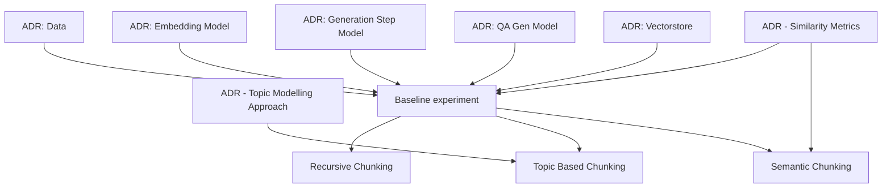

# Experiment Family: Chunking Strategies

## Summary

Overall experiment description from the Garden:

This experiment family is intended to highlight the decision process for selecting a chunking strategy and is part of a broader educational asset, which includes notebooks and azure implementations of considered approaches to generative ai solutions. 

One of the challenges of vector-store-grounded LLM scenarios (RAG) is the quality of search results. This is partially due to embedding issues, and partially due to what we embed. We need to better understand the performance characteristics of our choice for what we embed - our default solution is to chunk the documents and embed overlapping chunks, but there are other options - embedding summarizations, using an LLM to generate question/answer pairs that it believes the document can answer, and embedding those, etc. In a domain-specific scenario, where embeddings tend to cluster and it can be hard to tease out relevant results for a particular query against large document chunks, how do these other options impact search relevance?

This describes several possible experiments - in this document we will be focused on the impact of chunking strategies on overall search relevance.

## Outline

"Chunking Strategies" consists (currently) of 4 main experiments:

- [baseline](./00-chunking-strategies-family.md)
- [Recursive Chunking](./02-chunking-strategies-recursive.md)
- [Topic Based Chunking](./03-chunking-strategies-topics.md)
- [Semantic Chunking](./04-chunking-strategies-semantic.md)

These experiments depend on the following:
- [ADR - Data](adrs/ADR%20-%20Data.md)
- [ADR - Embedding Model](adrs/ADR%20-%20Embedding%20Model.md)
- [ADR - Generation Step Model](adrs/ADR%20-%20Generation%20Step%20Model.md)
- [ADR - QA Gen Model](adrs/ADR%20-%20QA%20Gen%20Model.md)
- [ADR - Similarity Metrics](adrs/ADR%20-%20Similarity%20Metrics.md)
- [ADR - Topic Modelling Approach](adrs/ADR%20-%20Topic%20Modelling%20Approach.md)
- [ADR - Vectorstore](adrs/ADR%20-%20Vectorstore.md)

## Plan

To start the experiment, we must select appropriate constants for the experiment family - this will be done in the ADRs.

We will begin with an exploration of the data, and in particular focus on understanding how to look at documents, and understand the relationship of document attributes (e.g. length) to selecting a chunking strategy. We will explore the definition of a chunk and what makes a "good" chunk, which we will aim to tie to our measurement criteria.

We will then define a chunking and evaluation harnesses to be used across the experiments, starting with the baseline. After each experiment, we will review and publish the results that have been captured in AI Studio. 

Given that all experiments depend on the baseline, the experiment dependency graph looks like:

## Dependencies

### Data
<!-- Optional if experiment family does not require data -->
For this experiment we will be using the [Scientific Papers](https://huggingface.co/datasets/scientific_papers) dataset from Hugging Face. Given the size of the dataset, and the educational nature of the experiment family we will apply to following constraints:
- We will exclude documents that are excessively large
- We will exlcude documents that appear corrupted or erroneous
- We will subset the data down to a random sample of <X> documents 

### Measure of Success
<!-- Creator should fill this in -->

We will be using he OOTB LLM assisted evaluation metrics from the Ragas package. These are:
1. *Faithfulness*: This measures the factual consistency of the generated answer against the given context. It is calculated from answer and retrieved context. The answer is scaled to (0,1) range. Higher the better.
2. *Answer Relevancy*: The evaluation metric, Answer Relevancy, focuses on assessing how pertinent the generated answer is to the given prompt. A lower score is assigned to answers that are incomplete or contain redundant information and higher scores indicate better relevancy.
3. *Answer Semantic Similarity*: The concept of Answer Semantic Similarity pertains to the assessment of the semantic resemblance between the generated answer and the ground truth. This evaluation is based on the ground truth and the answer, with values falling within the range of 0 to 1. A higher score signifies a better alignment between the generated answer and the ground truth.

**Source**: [Ragas Documentation](https://docs.ragas.io/en/stable/concepts/metrics/index.html#ragas-metrics)

## More Information
<!-- Optional -->

{ Any additional links or details that may help crews come up to speed quickly and be more effective.}