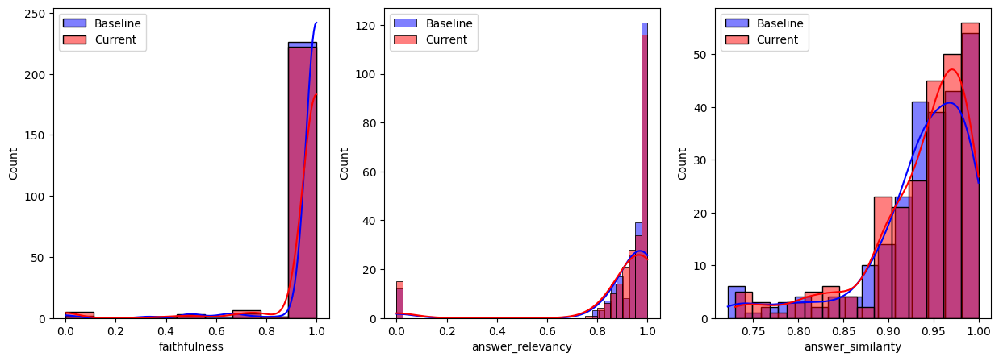

# Chunking Strategies: Semantic Chunking

## Experiment Summary

Overall experiment description from the Garden:

This experiment family is intended to highlight the decision process for selecting a chunking strategy and is part of a broader educational asset, which includes notebooks and azure implementations of considered approaches to generative ai solutions. 

One of the challenges of vector-store-grounded LLM scenarios (RAG) is the quality of search results. This is partially due to embedding issues, and partially due to what we embed. We need to better understand the performance characteristics of our choice for what we embed - our default solution is to chunk the documents and embed overlapping chunks, but there are other options - embedding summarizations, using an LLM to generate question/answer pairs that it believes the document can answer, and embedding those, etc. In a domain-specific scenario, where embeddings tend to cluster and it can be hard to tease out relevant results for a particular query against large document chunks, how do these other options impact search relevance?

This describes several possible experiments - in this document we will be focused on the impact of chunking strategies on overall search relevance.

### Hypothesis
<!-- Creator should fill this in -->

Chunking documents based on different strategies will result in significant differences in search relevance. Semantic chunking checks the semantic consistency of subsets of text (typically sentences) with a rolling window, creating a chunk when a minimum threshold for semantic relevance is reached.

We expect this approach will deliver an uplift across all metrics relative to the baseline, and the recursive method.

### Impact
<!-- Creator should fill this in -->

When choosing a chunking strategy for chunking whole documents, we need insight into how our choices impact search relevance and how those choices should vary based on document length.

### Measure of Success
<!-- Creator should fill this in -->

We will be using he OOTB LLM assisted evaluation metrics from the Ragas package. These are:

1. *Faithfulness*: This measures the factual consistency of the generated answer against the given context. It is calculated from answer and retrieved context. The answer is scaled to (0,1) range. Higher the better.
2. *Answer Relevancy*: The evaluation metric, Answer Relevancy, focuses on assessing how pertinent the generated answer is to the given prompt. A lower score is assigned to answers that are incomplete or contain redundant information and higher scores indicate better relevancy.
3. *Answer Semantic Similarity*: The concept of Answer Semantic Similarity pertains to the assessment of the semantic resemblance between the generated answer and the ground truth. This evaluation is based on the ground truth and the answer, with values falling within the range of 0 to 1. A higher score signifies a better alignment between the generated answer and the ground truth.

**Source**: [Ragas Documentation](https://docs.ragas.io/en/stable/concepts/metrics/index.html#ragas-metrics)

Once we have the metrics, we will either conduct a ttest of a Mann-Whitney U Test depending on the distributions of the metrics. 

Given this is a preliminary set of experiements looking for indicators of performance differentials, we will set and alpha of 0.2.

## Methodology

### Initial Plan
<!-- Creator should fill this in -->

Experimenter should:
- [X] Execute the chunking strategy on the [agreed dataset](adrs/ADR%20-%20Data.md).
- [X] Embed the chunks using the [agreed embedding model](adrs/ADR%20-%20Embedding%20Model.md).
- [X]] Create an appropriately named index in the [vector store](adrs/ADR%20-%20Vectorstore.md) and load all chunks and associated metadata 
- [X] Run the questions dataset against the newly created index 
- [X] Evaluate the search results for a set of queries against the vector store using the metrics noted in the [Measures of Success](#measure-of-success) section.
- [X] Analyze the results to determine if there are statistically significant differences in the results based on the chunking strategy used, and if so, what those differences are.

### Assumptions and Limitations

#### Assumptions

- A1: The dataset being used is of high enough quality for illustration purposes
- A2: ADA-v2 will be sufficient on this dataset for illustration purposes

#### Limitations

- L1: We are using a generic embedding model that has not been fine tuned for the domain, which may result in infalted similarity scores between embeddings 
- L2: For illustration purposes we are using a subset of 50 document
- L3: Our Q&A dataset is generated by GPT 4 ith no SME input - this creates predominantly fact based questions rather than those that would be typical of a user.

### Data Specification

- For information on the raw data, see [experiment family definition](./00-chunking-strategies-family.md)
- For all experiments in the family, there are two input datasets generated in the [00-Chunking Strategies.ipynb](../00-Chunking%20Strategies.ipynb) notebook. They are:
    1. input_data: this is a subset of 50 documents selected at random from the corpus. 
    2. evaluation_data: this is a set of question and answer pairs generated from the sample documents using GPT 4

## Execution 

### Execution Details
<!-- Experimenter should fill this in -->

{In conducting this experiment, how did you deviate from the initial plan, and why? Is there anything we can learn from those deviations that may influence future experiments?}

The approach was largely unchanged from the Initial plan, with the exception of an additional step to understand the semantic relationships between sequential sentences to assist in defining chunking parameters.

## Results
<!-- Experimenter should fill this in -->

{What were the concrete results of the experiment? How do those results compare to your expectations? Was this a success or a failure?}

### Results Summary

### Results References
<!-- Experimenter should fill this in -->

{If the experiment was executed in a Jupyter Notebook, link to the notebook here.}

#### Semantic vs Baseline

Two out of three of the metrics saw a raw increase relative to the baseline experiment.

|Baseline	|Semantic	|Baseline Std|	Semantic Std|
|---------|--------|---------|--------|
|Faithfulness|	0.947555|	0.964276|	0.110322|	0.160372|
|Answer Relevancy|	0.957002|	0.898045|	0.150584|	0.232620|
|Answer Similarity|	0.922239|	0.937491	|	0.165479|	0.057192|

We observed that none of the metrics followed a normal distribution, so we applied the Mann-Whitney U Test. The results were as follows:

```
*****--- Mann-Whitney U Test ---*****
Null Hypothesis: The distribution of the metric is the same for the baseline and current results
Alternative Hypothesis: The distribution of the metric is different for the baseline and current results


faithfulness p-value: nan
answer_relevancy p-value: nan
answer_similarity p-value: 0.021917571575875455

```

We can see that the difference in answer_similarity score is again the only statistically significant difference based on our alpha of 0.2, meaning that we can be confident that this strategy results in generated answers that are semantically closer to the ground truth data.  

The absolute drop in relevancy was interesting, but given the effect was not statistically significant we won't dive deeper for now.

#### Semantic vs Recursive

The results of these two strategies are very similar when reading the absolute results. 

|Recursive	|Current	|Recursive Std|	Current Std|
|------|-----|-----|------|
|Faithfulness|	0.974960|	0.964276|	0.123614|	0.160372|
|Answer Relevancy|	0.911149|	0.898045|	0.210866|	0.232620|
|Answer Similarity|	0.936547|	0.937491|	0.059085|	0.057192|

We can also see that the distributions of the metrics are very similar


Running the Mann-whitney U Test confirms that there are no statistically significant differences across our metrics based on our alpha of 0.05.

This is great as it means that there's no good reason to invest extra time, money and complexity into following the semantic chunking strategy!

## Review
<details><summary>Review Summary (click to expand)</summary>
What were the key takeaways from the review process? Were there any significant issues raised during review that need to be addressed?
</details>

### [Optional] Additional references
<!-- Experimenter should fill this in -->

{If there are any other related notebooks/experiments or external references that are relevant for this experiment.}